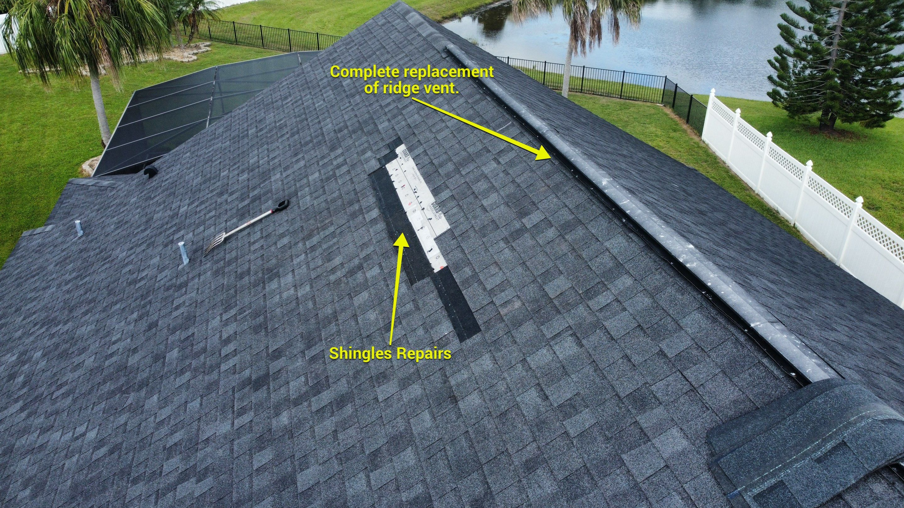
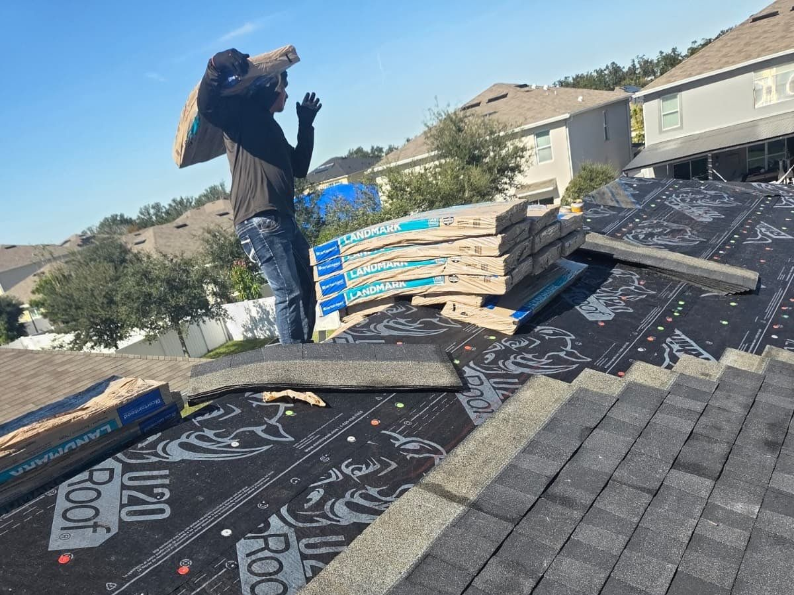
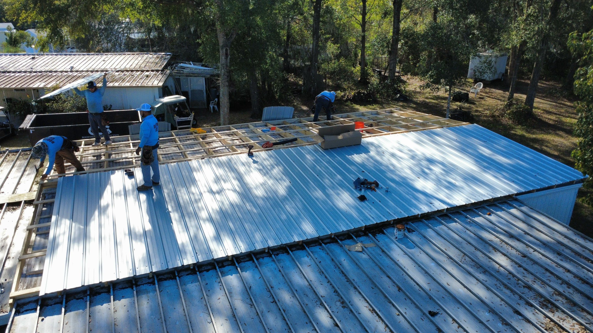
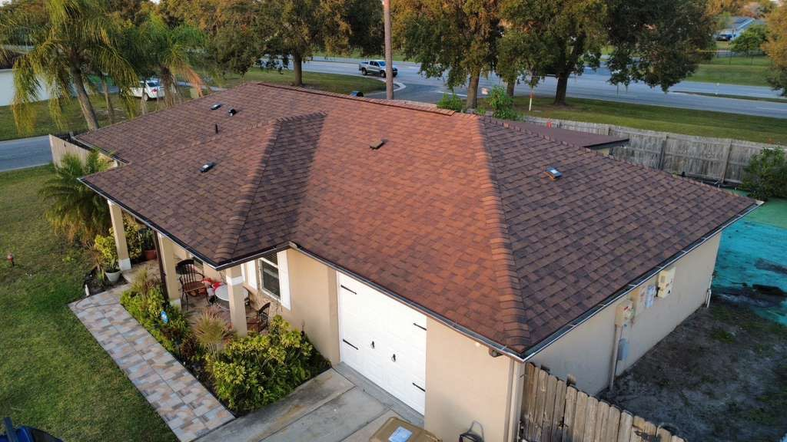
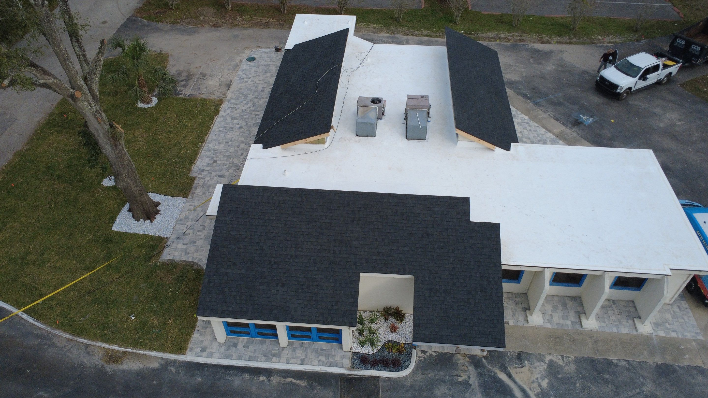
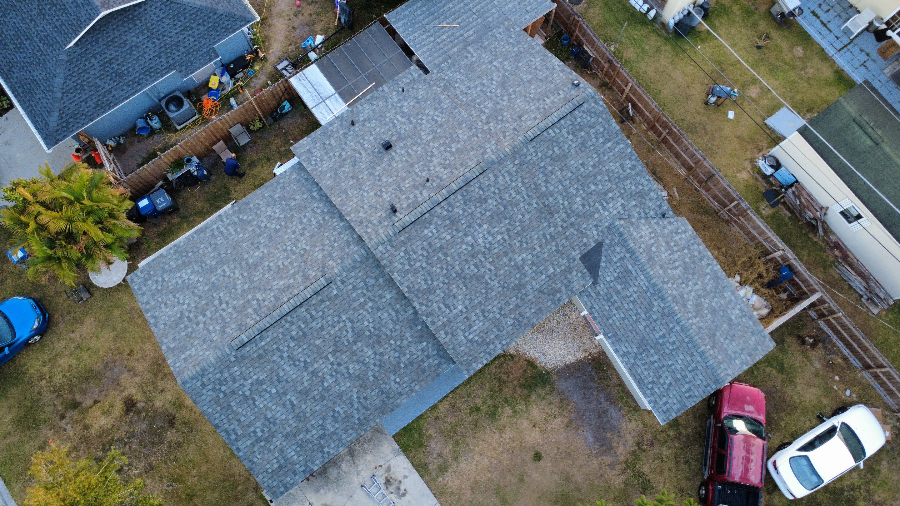
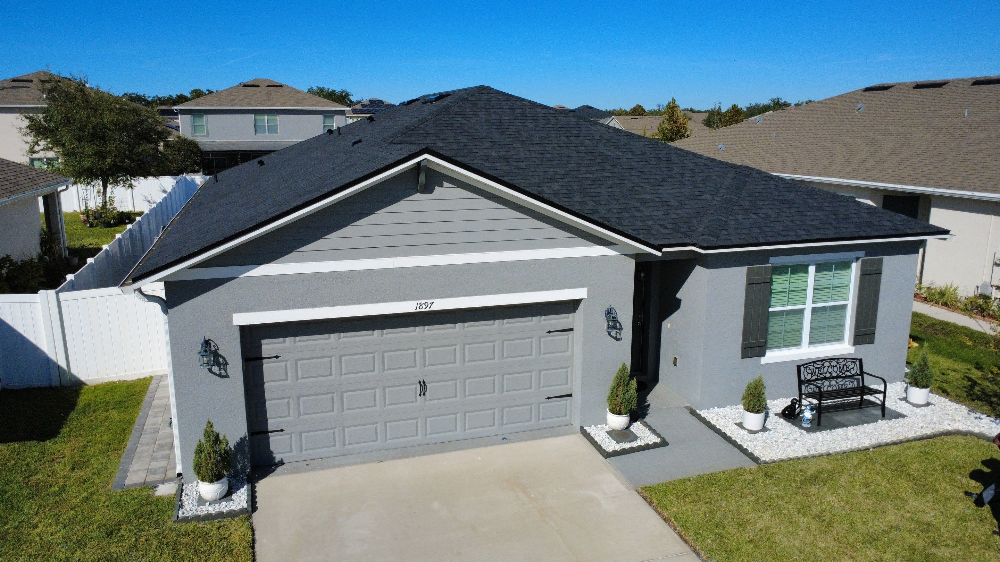
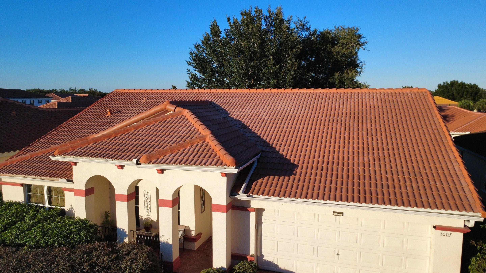
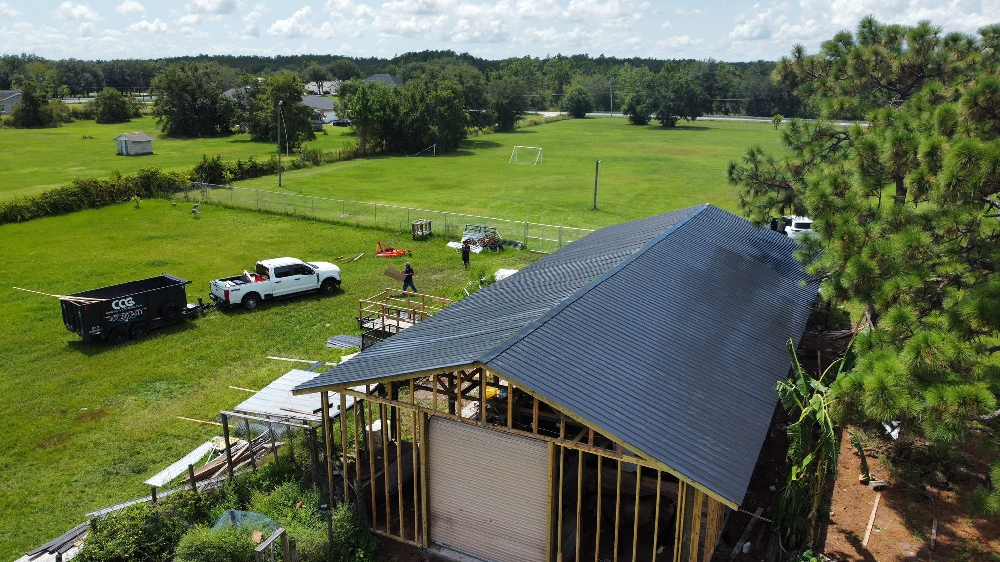

<!DOCTYPE html>
<html lang="en">
<head>
  <meta charset="UTF-8">
  <meta name="viewport" content="width=device-width, initial-scale=1">
  <title>Caricare Group LLC | Roofing Experts</title>
  <link href="https://cdn.jsdelivr.net/npm/bootstrap@5.3.3/dist/css/bootstrap.min.css" rel="stylesheet">
  <link href="https://cdn.jsdelivr.net/npm/bootstrap-icons@1.11.3/font/bootstrap-icons.css" rel="stylesheet">
  

  
</head>
<body>

<!-- NAVBAR -->
<nav class="navbar navbar-expand-lg navbar-dark bg-dark sticky-top">
  

    <a class="navbar-brand d-flex align-items-center" href="#">
      
      Caricare Group LLC
    </a>

    <button class="navbar-toggler" type="button" data-bs-toggle="collapse" data-bs-target="#nav">
      
    </button>

    

      <ul class="navbar-nav ms-auto">
        <li class="nav-item"><a class="nav-link" href="#services">Services</a></li>
        <li class="nav-item"><a class="nav-link" href="#process">Process</a></li>
        <li class="nav-item"><a class="nav-link" href="#contact">Contact</a></li>
      </ul>
      <a href="tel:+14072059411" class="btn btn-warning ms-3">Call Now</a>
    

  

</nav>

<!-- HERO -->
<section class="hero">
  

    <h1 class="display-4 fw-bold">Florida’s Most Reliable Roofing Company</h1>
    
Fast Estimates • 5-Star Service • Residential & Commercial

    

      <a href="#contact" class="btn btn-warning btn-lg me-2">Get Free Estimate</a>
      <a href="tel:+14072059411" class="btn btn-outline-light btn-lg">Call Now</a>
    

    

      ⭐ 5.0 Google Rating • Licensed & Insured • Serving Florida
    

  

</section>

<!-- SERVICES -->
<section id="services" class="section text-center">
  

    <h2 class="mb-5">Our Roofing Services</h2>
    

      <!-- 🔴 PUEDES AGREGAR IMAGEN DENTRO DE CADA CARD -->
      

        

           <!-- OPCIONAL -->
          <h5>Roof Repair</h5>
          
Quick leak fixes and damage restoration.

        

      

      

        

          
          <h5>Roof Replacement</h5>
          
Full roof upgrades with premium materials.

        

      

      

        

          
          <h5>Roof Inspection</h5>
          
Detailed inspections to prevent costly issues.

        

      

    

  

</section>

<!-- REVIEWS -->
<section class="section bg-light">
  

    <h2 class="text-center mb-5">What Our Customers Say</h2>

    <!-- ELFSIGHT GOOGLE REVIEWS -->
    

  

</section>

<!-- PROCESS (IMPROVED FLOW) -->
<section id="process" class="section bg-light text-center">
  

    <h2 class="mb-3">Our Process</h2>
    

      Simple, fast, and transparent — starting with a <strong>FREE inspection visit</strong>.
    

    

      <!-- STEP 1 -->
      

        

          

            <i class="bi bi-search"></i>
          

          <h6>Free Inspection</h6>
          
We visit your property at no cost.

        

      

      <!-- ARROW -->
      

        <i class="bi bi-arrow-right fs-3 text-warning"></i>
      

      <!-- STEP 2 -->
      

        

          

            <i class="bi bi-file-earmark-text"></i>
          

          <h6>Estimate</h6>
          
Clear and honest pricing.

        

      

      <!-- ARROW -->
      

        <i class="bi bi-arrow-right fs-3 text-warning"></i>
      

      <!-- STEP 3 -->
      

        

          

            <i class="bi bi-house-gear"></i>
          

          <h6>Installation</h6>
          
Fast and professional work.

        

      

      <!-- ARROW -->
      

        <i class="bi bi-arrow-right fs-3 text-warning"></i>
      

      <!-- STEP 4 -->
      

        

          

            <i class="bi bi-check-circle"></i>
          

          <h6>Final Check</h6>
          
We ensure top quality.

        

      

    

    <!-- CTA -->
    

      <a href="#contact" class="btn btn-warning btn-lg">
        Schedule Your Free Inspection
      </a>
    

  

</section>

<!-- GALLERY GRID -->
<section id="gallery" class="section bg-light">
  

    <h2 class="text-center mb-5">Project Gallery</h2>

    

      <!-- 🔴 AQUI SUBES TUS FOTOS REALES -->
      

      

      

      

      

      

    

  

</section>

<!-- CTA -->
<section class="section cta text-center">
  

    <h2>Need Roofing Help? Call Us Now</h2>
    
Fast response. Free estimates. No pressure.

    <a href="tel:+14072059411" class="btn btn-warning btn-lg">Call Now</a>
  

</section>

<!-- CONTACT -->
<section id="contact" class="section">
  

    <h2 class="text-center mb-4">Request a Free Estimate</h2>
    

      

        <form>
          <input class="form-control mb-3" placeholder="Full Name">
          <input class="form-control mb-3" placeholder="Phone Number">
          <input class="form-control mb-3" placeholder="Email">
          <textarea class="form-control mb-3" placeholder="Tell us about your project"></textarea>
          <button class="btn btn-warning w-100">Get My Free Estimate</button>
        </form>
      

      

        <h5>Contact Info</h5>
        
<i class="bi bi-telephone"></i> +1 407-205-9411

        
<i class="bi bi-geo-alt"></i> Serving all Florida

        
<i class="bi bi-clock"></i> Mon-Sat: 8AM - 8:30PM

      

    

  

</section>

<!-- FLOATING CALL BUTTON -->
<a href="tel:+14072059411" class="btn btn-warning sticky-cta">
  <i class="bi bi-telephone-fill"></i>
</a>

<!-- FOOTER -->
<footer>
  

    
© 2026 Caricare Group LLC. All rights reserved.

  

</footer>

<!-- ELFSIGHT SCRIPT -->

</body>
</html>
